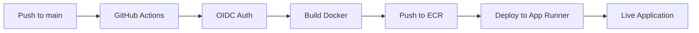

# 🎓 W501 Homework: RAG Application with GitHub → Docker → AWS → Cloudflare Pipeline

A complete RAG (Retrieval-Augmented Generation) application built with **LangChain** and **FAISS** that answers questions about CS336 Spring 2025 Assignment 1 Basics.

## 📝 Project Overview

This project fulfills all W501 homework requirements:

### ✅ Requirement a: Infrastructure as Code (IaC)
- Terraform configuration (`main.tf`) creating:
  - GitHub OIDC provider for secure authentication
  - Amazon ECR repository for Docker images
  - AWS App Runner service and roles
  - AWS Secrets Manager for API keys

### ✅ Requirement b: CI/CD Pipeline
- GitHub Actions workflow (`.github/workflows/deploy.yml`)
- Automated deployment on push to `main` branch
- OIDC authentication (no hardcoded credentials!)
- Docker build with GitHub SHA tagging
- Automatic deployment to AWS App Runner

### ✅ Requirement c: Networking
- App Runner default domain: `*.awsapprunner.com`
- Custom domain via Cloudflare: `rag.spark-amplify.com`
- CNAME configuration for public access

---

## 🛠 Tech Stack

| Component | Technology |
|-----------|-----------|
| **Backend** | Python 3.11, Flask |
| **RAG Framework** | LangChain 0.1.0 |
| **Vector Database** | FAISS (CPU) |
| **LLM** | OpenAI GPT-3.5-turbo |
| **IaC** | Terraform ~> 5.0 |
| **CI/CD** | GitHub Actions (OIDC) |
| **Container Registry** | AWS ECR |
| **Deployment** | AWS App Runner |
| **DNS/CDN** | Cloudflare |
| **Secrets Management** | AWS Secrets Manager |

---

## 🚀 Quick Start

### Prerequisites

1. **AWS Account** with appropriate permissions
2. **GitHub Account** and repository
3. **OpenAI API Key** from https://platform.openai.com/api-keys
4. **Terraform** installed: https://www.terraform.io/downloads
5. **Cloudflare Account** with domain `spark-amplify.com`

### Step-by-Step Deployment

#### 1️⃣ Configure Terraform Variables

```bash
cp terraform.tfvars.example terraform.tfvars
```

Edit `terraform.tfvars`:
```hcl
github_org_or_user = "your-github-username"
github_repo_name = "your-repo-name"
openai_api_key = "sk-proj-..."
manage_apprunner_via_terraform = false
```

#### 2️⃣ Deploy Infrastructure

```bash
terraform init
terraform plan
terraform apply
```

**Save all outputs!** You'll need them for GitHub Secrets.

#### 3️⃣ Configure GitHub Secrets

Go to: `Repository → Settings → Secrets and variables → Actions`

Add these 4 secrets:

| Secret Name | Value Source |
|------------|--------------|
| `AWS_REGION` | `us-east-1` |
| `ECR_REPOSITORY` | Output: `ecr_repository_name` |
| `AWS_IAM_ROLE_TO_ASSUME` | Output: `github_actions_role_arn` |
| `ACCESS_ROLE_ARN` | Output: `apprunner_service_role_arn` |

#### 4️⃣ Push to GitHub

```bash
git init
git add .
git commit -m "Initial commit: W501 RAG homework"
git branch -M main
git remote add origin https://github.com/your-username/your-repo.git
git push -u origin main
```

The GitHub Actions workflow will automatically:
1. Authenticate with AWS using OIDC ✓
2. Build Docker image ✓
3. Push to ECR with SHA tag ✓
4. Deploy to App Runner ✓

#### 5️⃣ Configure Cloudflare DNS

1. Get App Runner URL from deployment logs or AWS console
2. In Cloudflare dashboard for `spark-amplify.com`:
   - Type: `CNAME`
   - Name: `rag`
   - Target: `xxxxx.us-east-1.awsapprunner.com`
   - Proxy: DNS only (gray cloud)

3. Access your app at: `https://rag.spark-amplify.com`

---

## 📁 Project Structure

```
w501-homework/
├── .github/
│   └── workflows/
│       └── deploy.yml          # CI/CD pipeline (GitHub Actions)
├── static/
│   ├── index.html              # Frontend UI
│   ├── script.js               # Frontend logic
│   └── styles.css              # Styling
├── app.py                      # Flask application with RAG logic
├── Dockerfile                  # Container configuration
├── requirements.txt            # Python dependencies
├── main.tf                     # Terraform infrastructure
├── terraform.tfvars.example    # Terraform variables template
├── cs336_spring2025_assignment1_basics.pdf  # Knowledge base
├── README.md                   # This file
├── DEPLOYMENT_INSTRUCTIONS.md  # Detailed deployment guide
├── CLOUDFLARE_SETUP.md        # Cloudflare configuration guide
└── GITHUB_SECRETS_SETUP.md    # GitHub Secrets reference
```

---

## 🔍 How It Works

### RAG Pipeline

1. **Document Loading**: Extracts text from `cs336_spring2025_assignment1_basics.pdf`
2. **Text Splitting**: Chunks text into 1000-character segments with 200-char overlap
3. **Embedding**: Creates vector embeddings using OpenAI's embedding model
4. **Vector Storage**: Stores embeddings in FAISS for similarity search
5. **Retrieval**: Finds top 3 most relevant chunks for each query
6. **Generation**: Uses GPT-3.5-turbo to generate answer based on retrieved context

### CI/CD Pipeline



### Infrastructure

```
GitHub Actions (OIDC)
    ↓
AWS App Runner Service
    ↓
Docker Image (ECR)
    ↓
Flask App + LangChain + FAISS
    ↓
OpenAI API (via Secrets Manager)
```

---

## 🧪 Testing

Once deployed, test the application:

### Health Check
```bash
curl https://rag.spark-amplify.com/health
```

### Ask a Question
```bash
curl -X POST https://rag.spark-amplify.com/api/ask \
  -H "Content-Type: application/json" \
  -d '{"question": "What is the assignment about?"}'
```

### System Info
```bash
curl https://rag.spark-amplify.com/api/info
```

### Web Interface

Visit `https://rag.spark-amplify.com` and try:
- "What are the main topics in the CS336 assignment?"
- "What concepts should I understand?"
- "What are the requirements?"

---

## 📊 Homework Verification

### ✓ Part a: Infrastructure (IaC)

```bash
# Verify all resources
terraform show | grep "resource"

# Check specific outputs
terraform output github_actions_role_arn
terraform output ecr_repository_name
terraform output apprunner_service_role_arn
```

Expected resources:
- ✅ `aws_iam_openid_connect_provider.github_oidc`
- ✅ `aws_iam_role.github_actions_role`
- ✅ `aws_ecr_repository.rag_app_ecr`
- ✅ `aws_iam_role.apprunner_service_role`
- ✅ `aws_iam_role.apprunner_instance_role`
- ✅ `aws_secretsmanager_secret.openai_key`

### ✓ Part b: CI/CD Pipeline

**GitHub Actions Workflow:**
```bash
cat .github/workflows/deploy.yml | grep -E "aws-actions|awslabs|ECR|OIDC"
```

Should show:
- ✅ `aws-actions/configure-aws-credentials@v4` (OIDC)
- ✅ `aws-actions/amazon-ecr-login@v2`
- ✅ `awslabs/amazon-app-runner-deploy@main`
- ✅ Docker build with GitHub SHA tag

**GitHub Secrets:**
- ✅ `AWS_REGION = us-east-1`
- ✅ `ECR_REPOSITORY = bee-edu-rag-app`
- ✅ `AWS_IAM_ROLE_TO_ASSUME = arn:aws:iam::...`
- ✅ `ACCESS_ROLE_ARN = arn:aws:iam::...`

### ✓ Part c: Networking

**Cloudflare DNS:**
```bash
nslookup rag.spark-amplify.com
dig rag.spark-amplify.com CNAME
```

**Verify Access:**
```bash
# Direct App Runner URL
curl -I https://xxxxx.us-east-1.awsapprunner.com

# Custom Cloudflare domain
curl -I https://rag.spark-amplify.com
```

Both should return: `HTTP/2 200`

---

## 🔧 Troubleshooting

### GitHub Actions Fails

**Problem:** Authentication error with AWS

**Solution:**
```bash
# Verify role ARN in secrets matches terraform output
terraform output github_actions_role_arn

# Check role trust policy
aws iam get-role --role-name github-actions-deploy-role
```

### App Runner Won't Start

**Problem:** Service stuck in "Creating" or "Failed" state

**Solution:**
1. Check AWS App Runner logs in console
2. Verify Secrets Manager has OpenAI API key:
```bash
aws secretsmanager get-secret-value --secret-id bee-edu-openai-key-secret
```
3. Check Dockerfile is valid

### RAG Queries Fail

**Problem:** "Error processing question"

**Solution:**
1. Verify PDF is in Docker image:
```bash
docker run <image-id> ls -la cs336_spring2025_assignment1_basics.pdf
```
2. Check OpenAI API key is valid
3. Review Flask logs in App Runner

### Cloudflare DNS Issues

**Problem:** Domain not resolving

**Solution:**
1. Wait for DNS propagation (up to 24 hours)
2. Ensure CNAME record is "DNS only" (not proxied)
3. Verify target matches App Runner URL exactly

---

## 📚 Documentation

- **[DEPLOYMENT_INSTRUCTIONS.md](./DEPLOYMENT_INSTRUCTIONS.md)**: Comprehensive deployment guide
- **[CLOUDFLARE_SETUP.md](./CLOUDFLARE_SETUP.md)**: Detailed Cloudflare configuration
- **[GITHUB_SECRETS_SETUP.md](./GITHUB_SECRETS_SETUP.md)**: GitHub Secrets reference
- **[HOMEWORK_VERIFICATION.md](./HOMEWORK_VERIFICATION.md)**: Verify all requirements met

---

## 🎯 Key Features

### 🤖 RAG Application
- Answers questions about CS336 assignment using actual document content
- Returns source references for transparency
- Uses state-of-the-art LangChain + FAISS pipeline

### 🔐 Security
- OIDC authentication (no hardcoded AWS credentials)
- Secrets stored in AWS Secrets Manager
- Principle of least privilege IAM roles

### 🚀 Modern UI
- Clean, responsive design
- Real-time status indicators
- Interactive chat interface

### 📦 Production-Ready
- Health check endpoints
- Gunicorn production server
- Docker multi-stage build
- Automatic restarts

---

## 💡 Learning Outcomes

By completing this homework, you've learned:

1. **Infrastructure as Code**: Using Terraform to provision cloud resources
2. **CI/CD Pipelines**: Automating deployment with GitHub Actions
3. **Secure Authentication**: Implementing OIDC for GitHub → AWS
4. **Containerization**: Building and deploying Docker images
5. **RAG Systems**: Implementing retrieval-augmented generation
6. **Vector Databases**: Using FAISS for similarity search
7. **Cloud Services**: Working with ECR, App Runner, Secrets Manager
8. **DNS Management**: Configuring Cloudflare for custom domains

---

## 📈 Performance

- **Cold Start**: ~10-15 seconds (first request after deployment)
- **Warm Response**: ~2-3 seconds per query
- **Scalability**: Auto-scales with App Runner (0-25 instances)
- **Cost**: ~$0.05/hour for single instance (~$36/month at 1 vCPU, 2GB RAM)

---

## 🤝 Contributing

This is a homework project, but improvements are welcome:

1. Fork the repository
2. Create a feature branch
3. Make your changes
4. Test thoroughly
5. Submit a pull request

---

## 📄 License

This project is for educational purposes as part of the W501 course.

---

## 🙏 Acknowledgments

- **LangChain**: Amazing RAG framework
- **FAISS**: Efficient similarity search
- **OpenAI**: GPT-3.5-turbo API
- **AWS**: Serverless deployment infrastructure
- **Cloudflare**: DNS and domain management

---

## ⏱ Estimated Completion Time

**4-6 hours** (as specified in homework requirements)

Breakdown:
- Terraform setup: 1 hour
- GitHub Actions configuration: 1 hour
- Testing and debugging: 1-2 hours
- Cloudflare setup: 30 minutes
- Documentation: 1 hour

---

## 📞 Support

For issues or questions:
1. Check [DEPLOYMENT_INSTRUCTIONS.md](./DEPLOYMENT_INSTRUCTIONS.md)
2. Review troubleshooting section above
3. Check AWS CloudWatch logs
4. Review GitHub Actions workflow logs

---

**🎓 Good luck with your homework!**

Built with ❤️ using LangChain, FAISS, AWS, and Terraform
